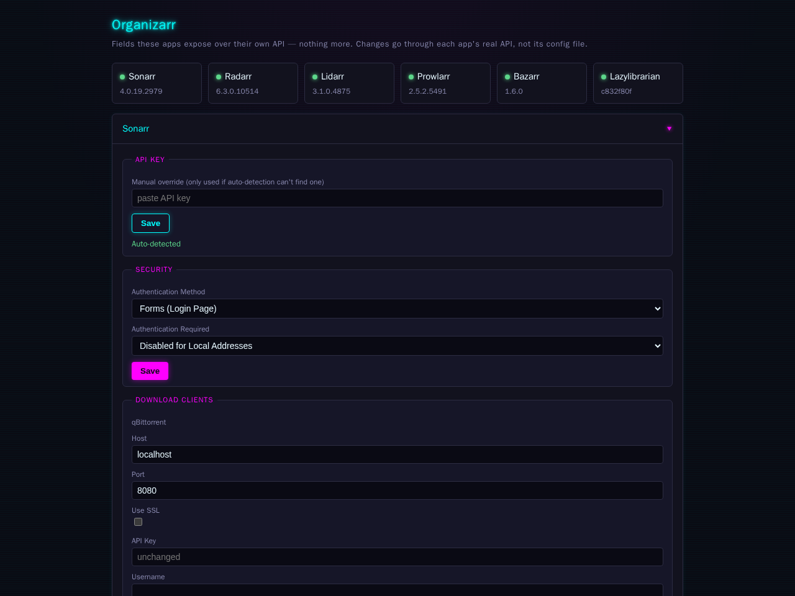

# Organizarr

One place for the `*arr` settings that are actually annoying to keep
consistent by hand: authentication method, download-client host/port,
and Prowlarr's application/indexer sync. Not a clone of every app's
full settings UI -- just the fields worth centralizing, edited through
each app's own real API, never by touching a config file directly.

Supports Sonarr, Radarr, Lidarr, Prowlarr, Bazarr, and LazyLibrarian.
Every app is optional -- turn one on by setting its `_URL` env var, skip
the rest.



## Why

If you run more than one or two of these, you already know the
annoyance: the same handful of settings -- is Forms auth still on after
a redeploy, does this app's download client actually point at the
right host, does Prowlarr actually know about every app -- live in five
different UIs with five different login screens (well, ideally one:
see [Security](#security) below). Organizarr puts the fields that
matter in one page, and gets out of the way for everything else.

## Quick start

The image is published to two registries from the same build, so the tags
are identical and you can use whichever you prefer:

- `ghcr.io/numbawon/organizarr:latest`
- `numbawon/organizarr:latest` (Docker Hub)

Tags available on both: `latest`, a semver tag per release, and the short
commit SHA of every build on `main`.


```yaml
# docker-compose.yml
services:
  organizarr:
    image: ghcr.io/numbawon/organizarr:latest
    ports:
      - "8000:8000"
    environment:
      SONARR_URL: http://sonarr:8989
      SONARR_CONFIG_PATH: /data/sonarr/config.xml
      RADARR_URL: http://radarr:7878
      RADARR_CONFIG_PATH: /data/radarr/config.xml
      PROWLARR_URL: http://prowlarr:9696
      PROWLARR_CONFIG_PATH: /data/prowlarr/config.xml
    volumes:
      - sonarr_config:/data/sonarr:ro
      - radarr_config:/data/radarr:ro
      - prowlarr_config:/data/prowlarr:ro
      - organizarr_data:/state
    networks:
      - your_stack_network

volumes:
  organizarr_data:

networks:
  your_stack_network:
    external: true
```

Any app you don't set a `_URL` for just doesn't show up -- no error, no
placeholder, it's as if it doesn't exist in this deployment.

## Environment variables

Every app follows the same two-variable pattern:

| Variable | Required | What it does |
|---|---|---|
| `<NAME>_URL` | Yes, to enable that app | Base URL Organizarr uses to reach the app's own API |
| `<NAME>_CONFIG_PATH` | No | Path (inside this container) to that app's config file, for automatic API key detection. Mount the app's config volume read-only at this path. |

`<NAME>` is one of `SONARR`, `RADARR`, `LIDARR`, `PROWLARR`, `BAZARR`,
`LAZYLIBRARIAN`.

If `<NAME>_CONFIG_PATH` isn't set (or the file isn't readable, or the
app hasn't finished its own first boot yet), that app's page shows a
manual API key field instead -- paste the key there and it works the
same way. Auto-detection is retried on every request, not just once at
startup, and always takes back over automatically the moment it
succeeds -- the manual entry is a fallback, not a permanent override.

`STATE_PATH` (default `/state`) -- where manually-entered API key
overrides are persisted. Mount a volume here if you want overrides to
survive a restart (recommended).

## Auto-detected key file formats

| App | Format | Where the key lives |
|---|---|---|
| Sonarr, Radarr, Lidarr, Prowlarr | `config.xml` | `<ApiKey>` element |
| Bazarr | `config.yaml` | `auth.apikey` |
| LazyLibrarian | `config.ini` | `api_key` |
| Cleanuparr | `users.db` (SQLite) | `users.api_key`, once `setup_completed` |

Cleanuparr's database is opened read-only through a URI, and deliberately
not with `immutable=1`: the app holds it open in WAL mode, so an immutable
open can hand back a snapshot from before the key was written.

## Wiring Cleanuparr to the *arr apps

Cleanuparr needs every *arr's URL and API key to act on their queues. On a
fresh deploy that is a pile of copy-paste out of config files Organizarr has
already read, and it is the only component holding all of them, so it can do
the wiring itself.

| Endpoint | Does |
|---|---|
| `GET /api/cleanuparr/arr` | Read-only. Reports what would change. Writes nothing. |
| `POST /api/cleanuparr/arr/sync` | Creates missing instances, re-enables disabled ones. |
| `POST /api/cleanuparr/arr/sync?rewrite_keys=true` | Also pushes the current key over existing instances. |

**Why `rewrite_keys` exists.** Cleanuparr masks the API key on read: a `GET`
returns `••••••••`, never the stored value. So whether an existing instance
still holds the right key cannot be determined from outside, and comparing
the mask against the real key would mark every instance stale forever. The
default is therefore to leave an existing, enabled instance alone and report
`key_verifiable: false`. Use `rewrite_keys=true` after rotating an *arr's
key, which is the one case where the stored value is known to be wrong.

Instances are matched on URL, so an entry pointing somewhere else is
reported under `other_instances` rather than being overwritten.

Only Sonarr, Radarr and Lidarr are mapped. Cleanuparr's controller also
carries `readarr`, `whisparr`, `sportarr` and `lazylibrarian`, but support is
probed per app rather than assumed: on the version tested, `lazylibrarian`
answered with the SPA fallback (HTML, not JSON), which is reported as
`unsupported` instead of failing.

## Security

Organizarr has **no login of its own**. It expects to sit behind a
reverse-proxy auth gate (Authentik forward-auth, Authelia, an
`nginx`/Traefik basic-auth middleware, whatever you already use) --
anyone who can reach it can view and change every configured app's
authentication settings and download-client credentials. Don't expose
it directly to the internet, and if you're running it alongside other
apps behind SSO, consider gating it more tightly than the rest (an
admins-only group, a separate provider) since its blast radius is
larger than any single app it manages.

API keys are read server-side only and never sent back to the browser,
auto-detected or manually entered.

## Development

```bash
docker build -t organizarr:local .
docker run --rm -p 8000:8000 \
  -e SONARR_URL=http://sonarr:8989 \
  --network your_stack_network \
  organizarr:local
```

No build step beyond the Dockerfile -- the frontend is a single static
HTML/JS file, no bundler.

## License

MIT -- see [LICENSE](LICENSE).
